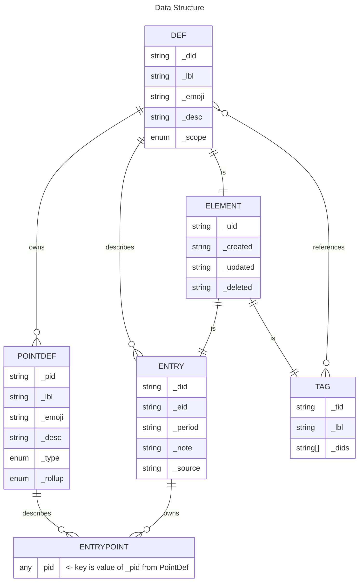

# Personal Data Warehouse

This **README** is what generates the top-level TypeDoc documentation page. 

The goal here is to have a pdw.ts library you could publish to NPM - along with a connector or two. This is a library development project, for a single codebase that can be used to interact with local data or data in the cloud, depending on the storage connector.

Regarding TypeDoc - you can use images: 

You *could* also use Excalidraw for neat documentation. Or [this site](https://tsuml-demo.firebaseapp.com/) to generate UML maps and insert them into the markup here.

## Reminders

- The "out" directory was created by you in the tsconfig file in order to power the localtest functionality. You had to set: 
noEmit = false //was true
outDir = out //property didnt' exist

- You were able to set up a launch.json to run localtest.ts by simply pressing `f5`
- You can use [this site](https://tsuml-demo.firebaseapp.com/) to generate UML maps and insert them into the markup here.
- You got a good Vitest workflow going.

### Local Development
`npm run localtest` -or- `f5` runs src/local-test.ts --- it works great

Alternatively, run tests with `npm run test`

### Browser Development
`npm run dev` for Docs & browser-based stuff.

# Structure

## PDW

## Elements

There are three kinds of Elements. All of which extend from the abstract "Element" base class. This base class handles some common functions, and has 4 properties.

### Def

### Entry

### Tag

