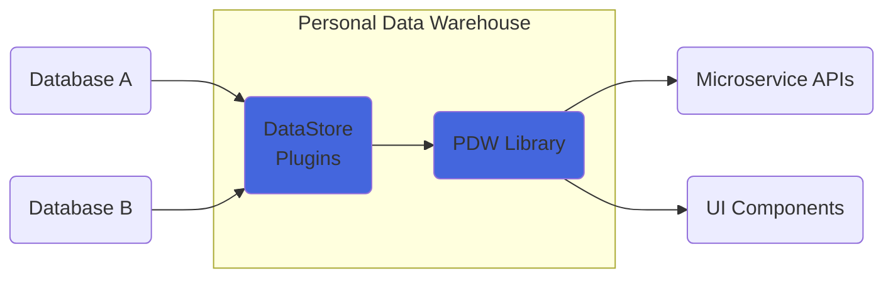
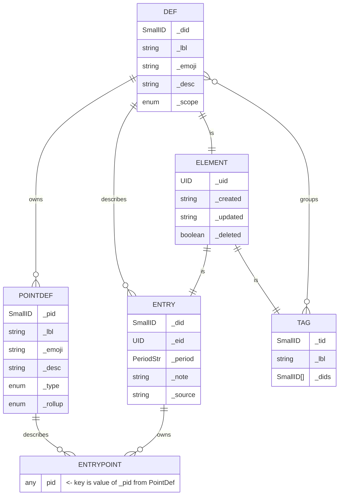

`pdw` is a library for creating quantified self applications. It's intended to be platform-agnostic with regard to the underlying database and the presentation layer. It handles the core logic, and provides interfaces out to whatever databases and whatever UI components you want to build.



The `pdw` library exists because I got tired of starting from scratch every time I wanted to migrate my personal quantified self system from one platform to another, and because I wanted a common backbone of code that made it easier to work with disparate datasets federated across multiple databases.

## Concepts

The library is built around a few core data structures: `Def`, `PointDef`, `Entry`, `EntryPoint`, `Tag` and `Period`

- A record of a thing that happened is called an `Entry`
- An Entry takes place during a time `Period`
- An entry contains zero or more `EntryPoint`s, which are data associated with the event that occurred
- An EntryPoint has a specified data type called a `PointType`
- An Entry has exactly one associated `Def`, which describes what the Entry means
- Each `Def` contains zero or more `PointDef`s, which describe the `EntryPoint`s contained by the `Entry` associated with that `Def`
- A `Tag` associates one or many `Def`s to a common label
- `Entry`, `Def`, and `Tag` are all generically called `Element`s, because they are not contained by anything and extend the same abstract base class
- A `DataStore` is a file or database that persists `Element`s in storage
- A `Query` searches a `DataStore` for Entries that match a set of `QueryParam`s
- A list of Entries can have their `EntryPoint` values summarized using `Rollup`s

> 👉 `Def`s contain `PointDef`s and describe `Entry`s, which take place in Periods
> 

An `Entry` is a record of a thing that occurred during a given period of time (`Period`). A Definition (or `Def`) describes a type of `Entry` that can exist. Every `Entry` has exactly **one** definfion. A `Def` contains zero or more `PointDef`s. A `PointDef` describes a key/value pair (called an `EntryPoint`) that can exist on its associated `Entry`. `EntryPoint`s may be of any type. Each entry is associated with exactly **one** `Period`, which range in their granularity from seconds to years. Running a `Query` will return `Entry` instances match the query's parameters. To aid in `Query`ing, there exist `Tag`s, whose only function is to help group related `Def`s together.

### Simplified Conceptual Example

*For the purposes of introduction, this section omits certain data properties to not confuse the main role of each data type.*

### Entry

An example entry, with some properties omitted for clarity.

```json
{
    _did: "rxyb",
    _period: "2023-08-20",
    aaaa: 10,
    bbbb: "Had a good day. Ate a *stellar* hamburger. Watched The Avengers."
}

```

### Related Definition

Definition for the example entry, also with some properties omitted for clarity.

```json
{
        _did: "rxyb",
        _scope: "DAY",
        _lbl: "Nightly Review",
        _desc: "A journal entry I make every night before bed",
        _pts: [
            {
                _pid: "aaaa",
                _lbl: "Satisfaction",
                _desc: "How happy are you with the day, on a scale from 1 to 10?",
                _type: "NUMBER"
            },
            {
                _pid: "bbbb",
                _lbl: "Journal",
                _desc: "A paragraph about your day. What you did. How you felt.",
                _type: "MARKDOWN"
            },
        ]
    }

```

The `Def` describes the `Entry` because they share the same `_did` value. The `_pid` values found in the `PointDef`s in the  `Def._pts` array match to the keys of the the `Entry` that are not prefixed with an underscore. This dictates that those key/value pairs are `EntryPoint`s that are described by their matching `PointDef`.

### Principles

- Don’t delete. Don’t update*. Create new & mark old as deleted.
    - *updates allowed to: `_deleted`, `_updated`
- Surrogate IDs for everything!
    - `_did`, `_uid`, `_eid`, `_tid`, `_pid`
    - ID property values may never be changed once they are established
- Case doesn't matter. Everything gets trimmed.
- Timezones suck and are not included in Periods
- Data density is important! Don’t store redundant data

## Full Data Structure

The full data structure includes a few more properties that add features and make it possible to combine data from different datasets without duplication. Each of the `Entry`, `Def`, and `Tag` interfaces extend abstract base interface called `Element`. 



### Element

Entries, Definitions, and Tags are all “Elements”, because they all extend the `Element` interface:

```json
{
  _uid: "ekdjwjsn-pwl8",
  _created: "ekdjwjsn",
  _updated: "ekdjwjsn",
  _deleted: false
}
```

These properties enable the PDW to uniquely identify individual instances of each element (using the `_uid`), manage data updates, and handle merges of elements that might exist in multiple datasets.

### Def & PointDef

*Definitions* describe *Entries*. They may or may not contain *Point Definitions*, which would describe EntryPoints. Every definition contains a Definition ID (`_did`), label (`_lbl`), and level of granularity (`_scope`). Every PointDefinition contains a Point ID (`_pid`), its own label (`_lbl`), a point type (`_type`), a default rollup (`_rollup`), and a list of enumeration options (`_opts`).

```json
{
  _uid: "ekdjwjsn-pwl8",
  _created: "ekdjwjsn",
  _updated: "ekdjwjsn",
  _deleted: false,
  _did: "3pbm",
  _lbl: "Exercised",
  _emoji: "🏃‍♀️",
  _desc: "Broke a sweat in the name of fitness",
  _scope: "SECOND",
  _pts: [
    {
      _pid: "bw7k",
      _lbl: "Workout Type",
      _emoji: "🏋️‍♀️",
      _desc: "The genre of exercise you did",
      _type: "ENUM",
      _rollup: "COUNTEACH",
      _opts: {
        "2akb": "Strength",
        "maaf": "Cardio",
        "82p9": "Mobility"
      }
    }
  ]
}
```

### Entry

An `Entry` is a record of an event that happened during some period of time. It is associated with exactly one defining `Def`, which it will share the same `_did` value. All entries must have a `_period`, which is an ISO8601-formatted string and **does not contain** timezone information. All periods have standard `_source` and `_note` properties, which default to an empty string. 

Entry properties that are ***not*** prefixed with an underscore are `EntryPoint`s. Their key should correspond to the `_pid` of a `PointDef` contained by the associated `Def`. The value of the EntryPoint should correspond with the PointDef’s `_type` enum value.  

```json
{
  _uid: "ekdppjxx-28si",
  _created: "ekdppjxx",
  _updated: "ekdppjxx",
  _deleted: false,
  _did: "3pbm",
  _note: "1.5 miles. sweat a ton",
  _period: "2028-08-22T17:30:50",
  _source: "iOS Shortcuts",
	"bw7k": "maaf"
}
```

### Tag

A `Tag` is a mechanism for grouping related `Def`s under a common label. If a Def is associated with a Tag, the Def’s `_did` will show up in the Tag’s `_dids` array. This allows a `Query` to quickly filter down to the set of related Defs.

```json
{
  _uid: "ek3sf9gk-3sgi",
  _created: "ek3sf9gk",
  _updated: "ek3sf9gk",
  _deleted: false,
  _tid: "fae3",
  _lbl: "health",
  _dids: ["3pbm", "gpai"]
}
```